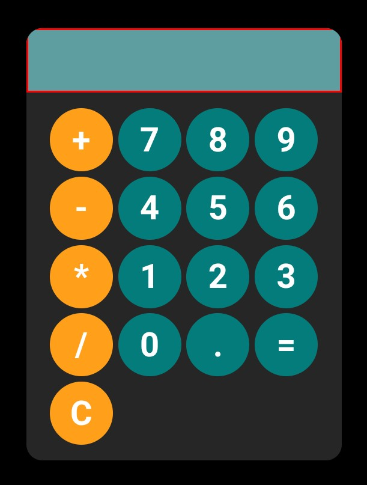

# 👋 Hello, I'm Palmira Georgieva!

# 🎯 About me
I'm Junior Front-End Developer passionate about creating responsive, user-friendly, and visually appealing web applications.

My journey started with HTML, CSS, and JavaScript, and I have continued developing my skills through projects, certifications, and hands-on practice with modern web technologies such as TypeScript, Git, GitHub, and PostgreSQL.

I enjoy turning ideas into functional websites, solving problems through code, and continuously learning new technologies. Currently, I am expanding my knowledge in Back-End Development with Node.js while strengthening my Front-End development skills.

I'm looking for opportunities to grow as a developer, contribute to meaningful projects, and gain real-world experience in the IT industry.

# 🧠 <h2>🛠️ Technologies</h2>

  

# 📂 Projects  

  <h3>Net-Sar Systems</h3>
  

  <h3>My Portfolio Page</h3>
  

  <h3>Basic Calculator App</h3>
  
  <h3>Watch App</h3>
  

# 📫 Contact  

  

<!---
PalmiraGeorgieva/PalmiraGeorgieva is a ✨ special ✨ repository because its `README.md` (this file) appears on your GitHub profile.
You can click the Preview link to take a look at your changes.
--->
