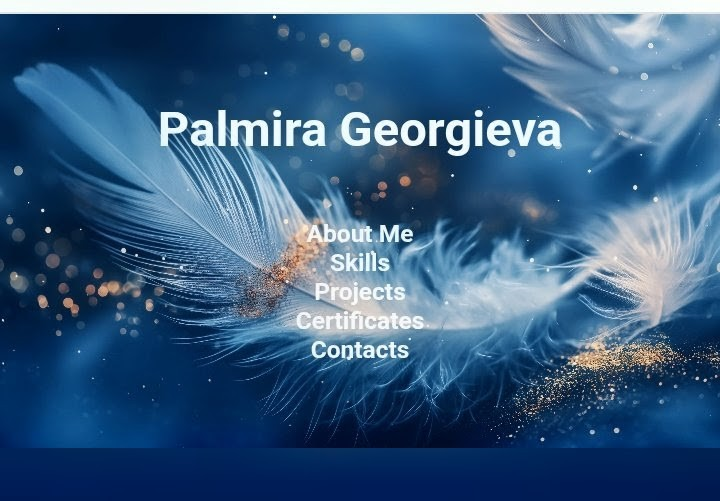
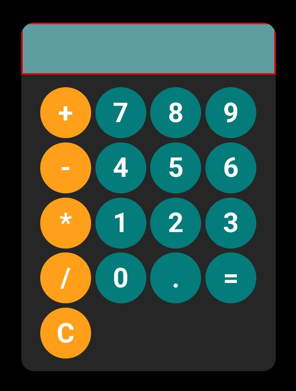
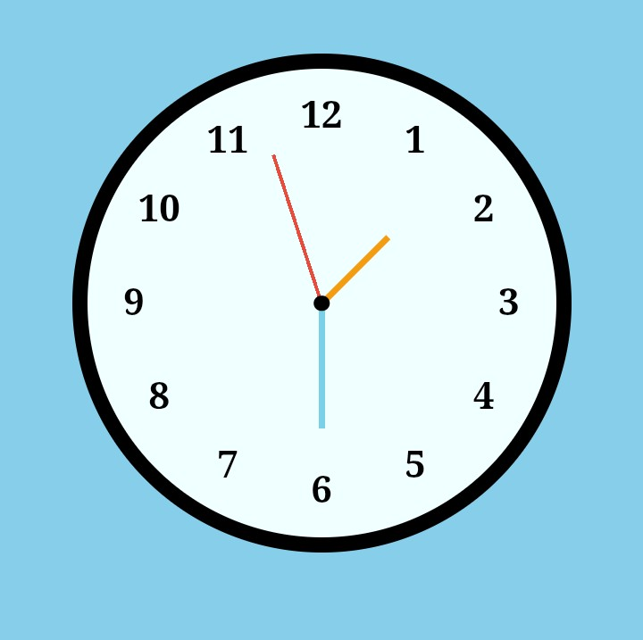

# 👋 Hello, I'm Palmira Georgieva!

# 🎯 About me
I'm a JavaScript & Web Development student focused on building modern, practical web applications.

💻 Currently working with JavaScript, React, Node.js, Express, PostgreSQL, and Prisma.
⚛️ Currently expanding my skills in React and modern frontend development.
🛠️ I enjoy building full-stack projects and turning ideas into functional applications.
🎨 Interested in web development, UI/UX, and graphic design.
🌱 Always learning, experimenting, and improving my code.

🚀 Current Project
 - Technicians Task Manager (TTM) — a React-based task management application for organizing and tracking technicians' work

🎯 Currently Learning

React • Full-Stack Web Development • Building scalable web applications

I believe the best way to learn programming is to build, experiment, make mistakes, and understand why the code works.

# <h2>🧰 Tech Stack</h2>

  

# 📂 Projects  
<table>
  <tr>
    <td align="center">
      <a href="https://net-sar.com/">
         
        <b>Net-Sar Systems (Local business for internet)</b>
      </a>
    </td>
    <td align="center">
      <a href="https://palmirageorgieva.github.io/">
         
       <b>My Portfolio Page</b>
      </a>
    </td>
  </tr>

  <tr>
    <td align="center">
      <a href="https://palmirageorgieva.github.io/calculatorapp-project.io/">
         
        <b>Basic Calculator App</b>
      </a>
    </td>
    <td align="center">
      <a href="https://palmirageorgieva.github.io/watch-pp-project.io/">
         
        <b>Watch App</b>
      </a>
    </td>
  </tr>
</table>

# 📫 Contact  

  

<!---
PalmiraGeorgieva/PalmiraGeorgieva is a ✨ special ✨ repository because its `README.md` (this file) appears on your GitHub profile.
You can click the Preview link to take a look at your changes.
--->
